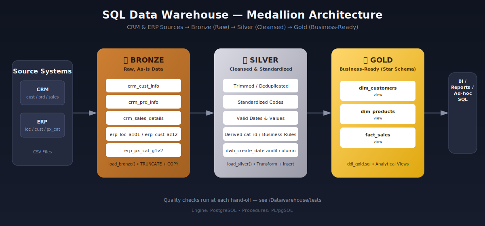
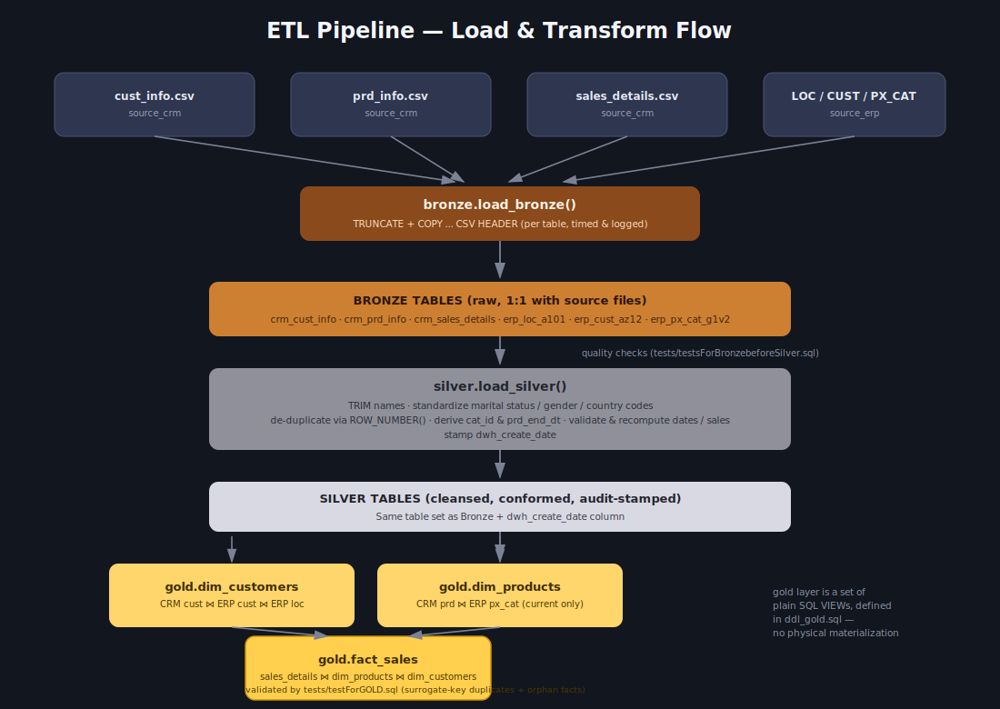
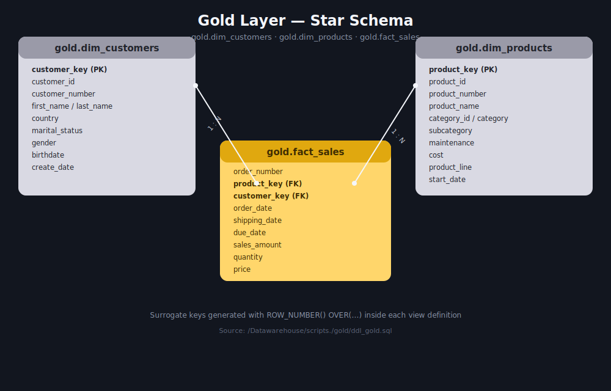

# SQL Data Warehouse

A PostgreSQL data warehouse built on the **Medallion Architecture** (Bronze → Silver → Gold). Raw CRM and ERP CSV extracts are ingested as-is, cleansed and standardized, and finally modeled into a business-friendly **star schema** ready for reporting and analytics.


<!-- PLACEHOLDER: docs/images/architecture.svg — end-to-end medallion architecture (sources → bronze → silver → gold → consumption) -->

---

## 📖 Overview

This project simulates a real-world enterprise data warehouse combining two source systems:

- **CRM** — customer, product, and sales transaction data
- **ERP** — customer demographics, location, and product category data

The warehouse is organized into three layers, each with its own schema, DDL scripts, and load procedures:

| Layer | Schema | Purpose |
|---|---|---|
| 🥉 **Bronze** | `bronze` | Raw, unmodified data loaded directly from source CSV files |
| 🥈 **Silver** | `silver` | Cleansed, standardized, and deduplicated data with business rules applied |
| 🥇 **Gold** | `gold` | Business-ready, dimensional (star schema) views for consumption |

---

## 🗂️ Repository Structure

```
SQL-Datawarehouse-main/
│
├── Datawarehouse/
│   ├── scripts./
│   │   ├── init_database.sql          # Creates bronze / silver / gold schemas
│   │   │
│   │   ├── bronze/
│   │   │   ├── ddl_bronze.sql         # Bronze table definitions
│   │   │   └── proc_load_bronze.sql   # bronze.load_bronze() — loads CSVs via COPY
│   │   │
│   │   ├── silver/
│   │   │   ├── ddl_silver.sql         # Silver table definitions (+ audit column)
│   │   │   └── proc_load_silver.sql   # silver.load_silver() — cleans & transforms
│   │   │
│   │   └── gold/
│   │       └── ddl_gold.sql           # Gold star-schema views (dims + fact)
│   │
│   └── tests/
│       ├── testsForBronzebeforeSilver.sql   # Bronze data-quality checks
│       └── testForGOLD.sql                  # Gold key-integrity checks
│
└── docs/
    └── images/                        # Diagrams referenced in this README
```

---

## 🏗️ Architecture

The pipeline follows the classic **Bronze → Silver → Gold** pattern:

1. **Bronze** — raw CRM/ERP `.csv` files are truncated and reloaded as-is into staging tables using PostgreSQL's `COPY` command. No transformation happens here; this layer exists purely for traceability back to the source.
2. **Silver** — data is cleaned: names are trimmed, codes (gender, marital status, country) are standardized into readable values, duplicate customer records are resolved, invalid dates are nulled out, and derived columns (like product category ID) are computed. An audit column (`dwh_create_date`) is stamped on every row.
3. **Gold** — silver tables are joined and reshaped into a dimensional model exposed as SQL views: two dimensions (`dim_customers`, `dim_products`) and one fact table (`fact_sales`), ready for BI tools and ad-hoc analysis.


<!-- PLACEHOLDER: docs/images/data_flow.svg — detailed load & transform flow from CSV sources through load_bronze(), load_silver(), to the gold views -->

---

## ⭐ Data Model (Gold Layer)

The gold layer exposes a simple **star schema**:

- **`gold.fact_sales`** — one row per sales order line, with foreign keys to both dimensions plus order/ship/due dates, sales amount, quantity, and price.
- **`gold.dim_customers`** — customer attributes merged from CRM customer info, ERP demographic data, and ERP location data.
- **`gold.dim_products`** — current product attributes merged from CRM product info and ERP product category data (historical/expired products are excluded).


<!-- PLACEHOLDER: docs/images/data_model.svg — star schema diagram of fact_sales, dim_customers, dim_products -->

---

## ⚙️ Layer Details

### Bronze Layer
- **Tables:** `crm_cust_info`, `crm_prd_info`, `crm_sales_details`, `erp_loc_a101`, `erp_cust_az12`, `erp_px_cat_g1v2`
- **Load procedure:** `bronze.load_bronze()`
  - Truncates each table, then bulk-loads it with `COPY ... DELIMITER ',' CSV HEADER`
  - Logs load duration per table and total batch duration via `RAISE NOTICE`
  - Wrapped in exception handling that reports `SQLERRM` / `SQLSTATE` on failure

### Silver Layer
- **Tables:** same entities as Bronze, plus a `dwh_create_date` audit timestamp column
- **Load procedure:** `silver.load_silver()`
  - Deduplicates customers, keeping the most recent record per `cst_id` via `ROW_NUMBER()`
  - Standardizes categorical codes: `S/M` → `Single/Married`, `F/M` → `Female/Male`, `DE`/`US`/`USA` → full country names
  - Derives `cat_id` and normalizes `prd_key` from the raw product key, and computes `prd_end_dt` using `LEAD()` over product history
  - Validates and recomputes malformed integer-encoded dates and inconsistent sales/quantity/price combinations
  - Re-derives customer IDs prefixed with `NAS` and nulls out future-dated birthdates

### Gold Layer
- **Views:** `gold.dim_customers`, `gold.dim_products`, `gold.fact_sales`
- Surrogate keys (`customer_key`, `product_key`) are generated with `ROW_NUMBER() OVER (...)`
- Gender is resolved with a `COALESCE` fallback between CRM and ERP sources
- Only currently active products (`prd_end_dt IS NULL`) are included in `dim_products`

---

## ✅ Data Quality Testing

The `Datawarehouse/tests/` folder contains validation scripts run at key hand-off points:

- **`testsForBronzebeforeSilver.sql`** — checks for duplicate/null primary keys, untrimmed text fields, invalid date ranges, and inconsistent sales calculations in the Bronze layer before promoting data to Silver.
- **`testForGOLD.sql`** — checks for duplicate surrogate keys in the dimension views and orphaned fact rows (facts with no matching dimension key) in `gold.fact_sales`.

---

## 🚀 Getting Started

**Prerequisites:** PostgreSQL (with `psql` or any SQL client), and access to the source CRM/ERP CSV files.

1. **Create the schemas**
   ```sql
   \i Datawarehouse/scripts./init_database.sql
   ```
2. **Create Bronze tables and load raw data**
   ```sql
   \i Datawarehouse/scripts./bronze/ddl_bronze.sql
   \i Datawarehouse/scripts./bronze/proc_load_bronze.sql
   ```
   > Update the file paths inside `proc_load_bronze.sql` to point to your local CSV source files before running.
3. **Create Silver tables and transform the data**
   ```sql
   \i Datawarehouse/scripts./silver/ddl_silver.sql
   \i Datawarehouse/scripts./silver/proc_load_silver.sql
   ```
4. **Create the Gold views**
   ```sql
   \i Datawarehouse/scripts./gold/ddl_gold.sql
   ```
5. **Validate**
   ```sql
   \i Datawarehouse/tests/testsForBronzebeforeSilver.sql
   \i Datawarehouse/tests/testForGOLD.sql
   ```
6. Query the warehouse:
   ```sql
   SELECT * FROM gold.fact_sales LIMIT 100;
   ```

---

## 🛠️ Tech Stack

- **Database:** PostgreSQL
- **Procedural logic:** PL/pgSQL (`CREATE PROCEDURE`, exception handling, `RAISE NOTICE` logging)
- **Data loading:** `COPY` from CSV
- **Modeling:** Views-based star schema (no physical materialization)

---

## 📌 Notes

- File paths in `proc_load_bronze.sql` are currently hard-coded to a local Windows path and should be parameterized or updated for your environment.
- The Gold layer is implemented entirely as **views**, so it always reflects the latest Silver data with no separate refresh step required.
